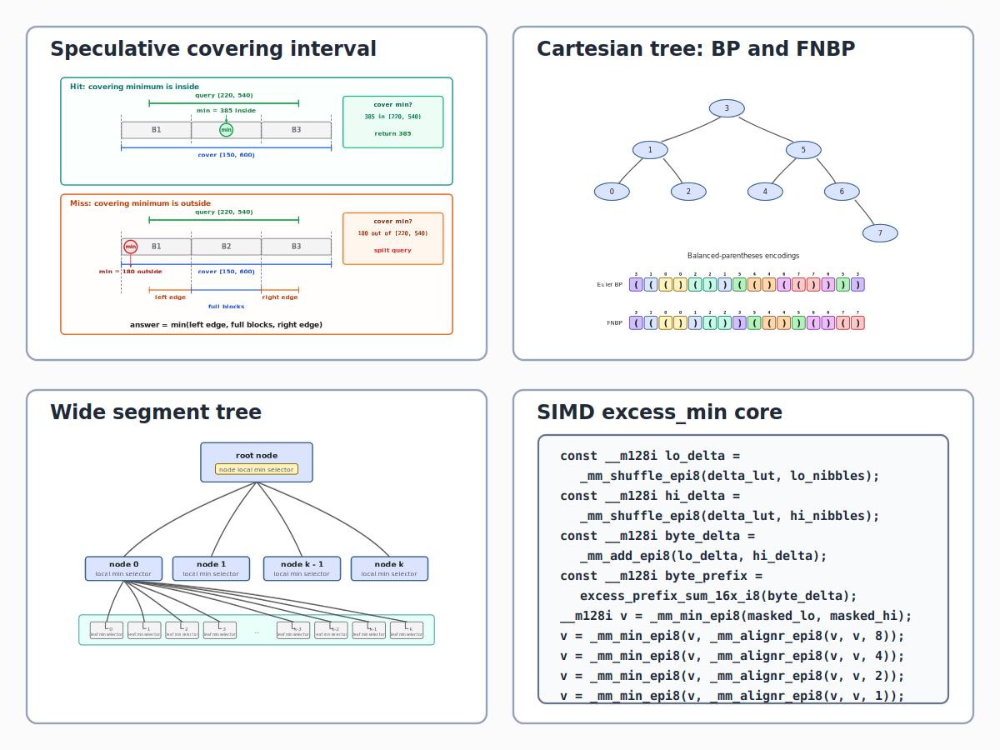
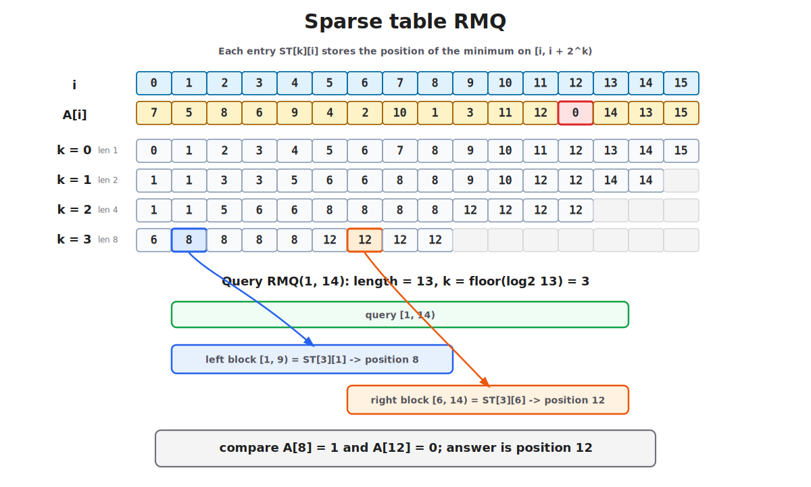
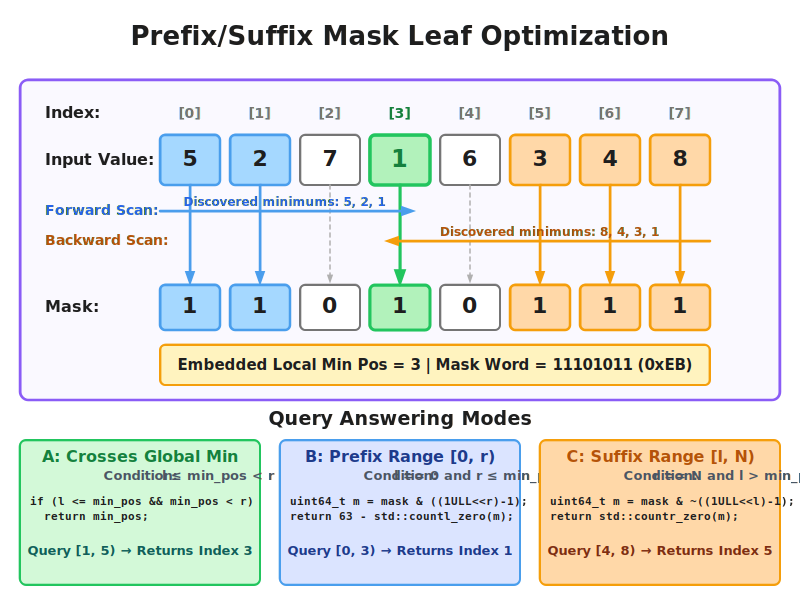
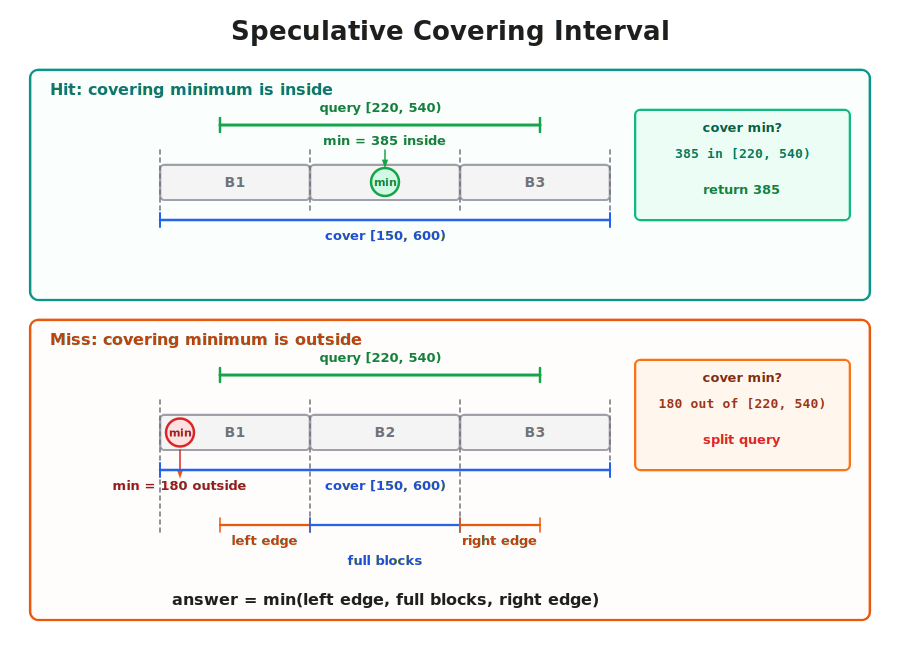
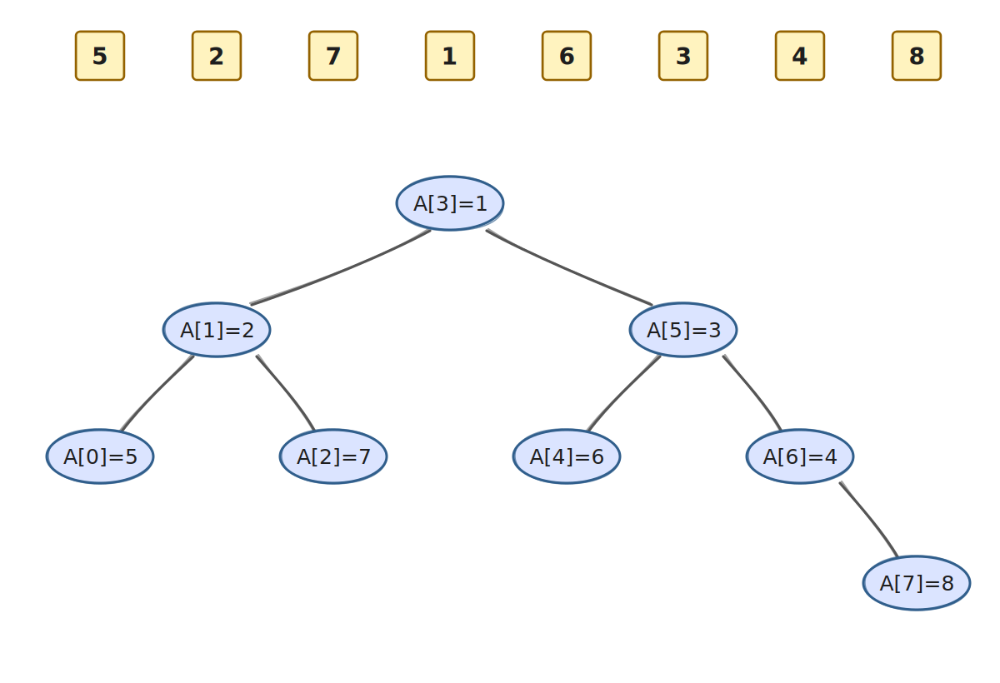
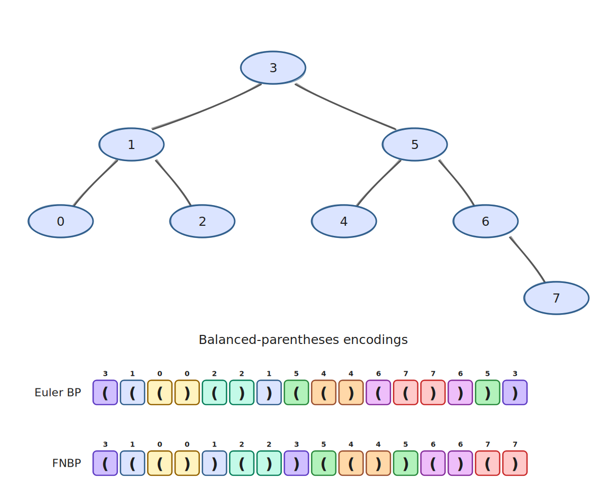
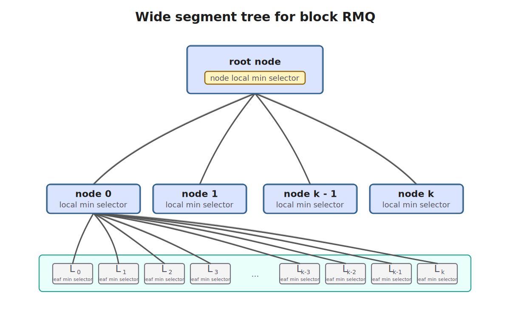
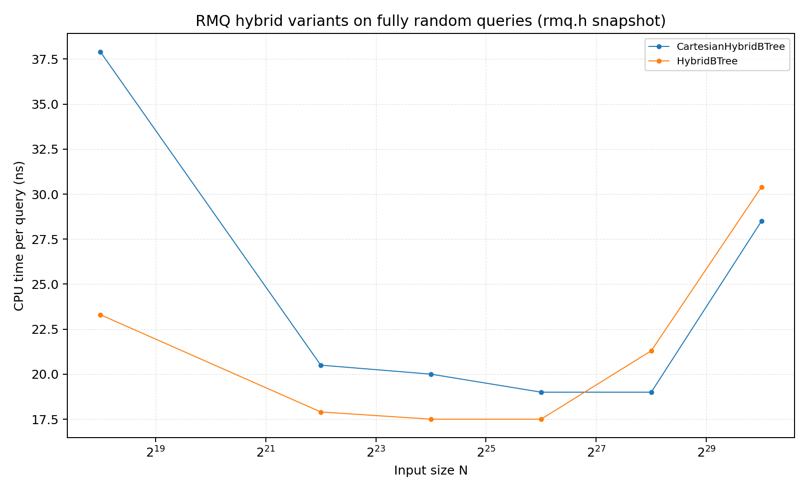

This note describes several advanced techniques for static RMQ, where the
array is known in advance and does not change, but the queries are not known
ahead of time. The goal is to build two succinct RMQ variants:

- one that uses $1.05n$ auxiliary bits and sometimes accesses the
  original array;
- one that uses $2.1n$ auxiliary bits and never accesses the
  original array.

Both implementations are fast in practice, reaching roughly $20$ to $30$ ns on
average for uniformly random queries over arrays of about $10^9$ elements.

For comparison, the [Codeforces tutorial on block-based RMQ](https://codeforces.com/blog/entry/78931) reports roughly $100$ ns per query on arrays of length
$10^7$ with 32-bit integers, while using 32 auxiliary bits per entry.

## AI disclosure

AI was extensively use for text writing, coding, experimentation and image generation for this article. Author (Nikolay Malkovsky) takes full responsibility for the content and possible mistakes/inaccuracies.

## Block-Based RMQ

We use the following formulation. Given an array $A[0..n-1]$, construct a data
structure that can answer this query quickly:

$$
RMQ(l, r) = \arg \min_{i \in [l, r)} A[i]
$$

Many practical RMQ data structures use *sparse tables* as one component; see
the [cp-algorithms sparse table article](https://cp-algorithms.com/data_structures/sparse-table.html)
for details.

The idea is simple: for each position $i$, precompute $RMQ(i, i + 2^k)$ for all
$k$ such that $i + 2^k \leq n$. To answer $RMQ(l, r)$, choose $k$ such that
$2^k \leq r - l < 2^{k+1}$ and compare the minima from the two overlapping
intervals $RMQ(l, l + 2^k)$ and $RMQ(r - 2^k, r)$.

{fig-alt="Sparse table rows store arg-min positions for intervals of power-of-two length; a query is answered by comparing two overlapping intervals."}

Sparse tables are good both in theory and in practice, but their
$\mathcal{O}(n \log n)$ memory usage limits practical applications. For
example, for 64-bit integers, sparse tables exceed typical L3 cache sizes at
around $10^5$ elements. To scale further, we use blocking: split the array into
blocks of size $b$, solve RMQ over whole blocks with a sparse table, and then
adjust the answer by solving the boundary parts inside the affected blocks.

The classical $\mathcal{O}(n)$-space, $\mathcal{O}(n)$-construction,
$\mathcal{O}(1)$-query solution to LCA by Farach-Colton and Bender
[@bender2000] uses exactly this kind of blocking. It takes
$b = \frac{\log_2 n}{2}$ and precomputes every possible query inside a single
block. A query spanning several blocks then needs two table lookups for the
boundaries and one sparse-table query for the middle; a query inside one block
needs only the precomputed block table. Practical solutions use the same shape,
but often solve boundary and block-internal queries differently; see the
[Codeforces tutorial on block-based RMQ](https://codeforces.com/blog/entry/78931)
for one practical walkthrough.


## Notes on Memory Access Patterns

The main problem when solving RMQ on long arrays is memory access: RAM is much
slower than processor cache and quickly becomes the bottleneck. For sparse
tables, for example, cache misses become visible once the table grows past cache
capacity.

There is still an interesting observation about sparse tables. For uniformly
random queries, about half of the intervals have length at least $n/2$, so they
are answered from the highest sparse-table levels. If levels are stored
together, this layout can reduce cache misses. As a result, a sparse table over
$10^7$ elements can still answer random queries in roughly $20$ to $30$ ns on
average even though the full table occupies several gigabytes.

## Base Optimizations

### Prefix/Suffix Minima Encoding

We start from the optimization described in the
[Codeforces tutorial on block-based RMQ](https://codeforces.com/blog/entry/78931).

The idea is to precompute answers for prefixes of a block. These answers form a
sequence of record minima: scan the elements left to right and store the position
whenever a new minimum appears. The answer to the query $[0, r)$ is then the
last stored position smaller than $r$, which can be found with a binary search.
For example, for the input array
$[5, 2, 7, 1, 6, 3, 4, 8]$, the sequence of prefix minima positions is
$[0, 1, 3]$.

Suffixes use the same logic. For short sequences, the best encoding is a
bitmask. Moreover, for a sequence of length $n$, a single $n$-bit mask can
encode both prefix and suffix minima. To answer prefix/suffix queries from this
mask, the only extra information we need is the global minimum position $m$:

- For prefix $[0, r)$, mask out bits at positions at least $\min(r, m + 1)$
  and find the highest set bit in the result.
- For suffix $[l, n)$, mask out bits at positions below $\max(l, m)$ and find
  the lowest set bit in the result.

Here is a visual depiction of this prefix/suffix mask layout and how different
query modes are answered for the input array $A = [5, 2, 7, 1, 6, 3, 4, 8]$:

{fig-alt="Answering prefix/suffix RMQ queries with a single bitmask and a minimum position."}

This information is not enough to answer arbitrary block-internal queries. One
possible solution is to store these masks for every position, but that is
overkill. For now, we first check whether an internal query contains the block
minimum position; on a miss, we simply do a linear scan over the original array.
The mask needs $n$ bits and we additionally need the minimum position; a natural
packed layout is therefore $248 + 8$ bits. Later we describe how this can be
generalized to $2n$ bits while supporting block-internal queries.

### Speculative Covering Interval Optimization

With a block-based approach, a query is usually split into three parts: the left
boundary, the middle full blocks, and the right boundary. If the query lies
inside a single block, it becomes one block-internal query instead. This split
is often heavier than necessary, so we can apply a **speculative covering
interval check**, following the practical covering-range idea used by Kowalski
and Grabowski in *Faster Range Minimum Queries* [@Kowalski2017FasterRMQ]:

1. Find the minimal block range $[B_L, B_R)$ that fully covers the query range $[l, r)$.
2. Retrieve the precomputed global minimum position $p$ for this covering block range.
3. If $l \le p < r$, return $p$ immediately.
4. If $p$ falls outside $[l, r)$, do the normal splitting.

This early-stop optimization is highly effective for large arrays.

{fig-alt="Diagram showing Speculative HIT (O(1) fast path) versus Speculative MISS (falling back to standard 3-way split)."}

## Cartesian Tree

The next important object is the *Cartesian tree*. It is built from an array as
follows: the minimum is the root, and the left and right subtrees are built
recursively from the left and right subarrays. Here is an example for the array
$[5, 2, 7, 1, 6, 3, 4, 8]$:



Cartesian trees are important for RMQ because RMQ reduces to LCA in the
Cartesian tree. They are also connected to the prefix/suffix minima discussed
above: those minima correspond to the leftmost and rightmost paths in the tree.

The standard way to solve LCA is to reduce it further to $RMQ \pm 1$. Perform a
DFS traversal, output the current depth on every move, and store the first visit
time of each node. The LCA of two nodes is then the node at the minimum depth
between their first visits. The key property of this RMQ instance is that
adjacent depths differ by exactly $1$. The classical Farach-Colton and Bender
approach [@bender2000] exploits this property and achieves $O(n)$ preprocessing
time and $O(1)$ query time with Four Russians-style tables for block-internal
queries. The algorithm is described in detail in
[e-maxx/cp-algorithms](https://cp-algorithms.com/graph/lca_farachcoltonbender.html).

What matters more here is that this depth-style $RMQ \pm 1$ instance can be
encoded as a compact binary string: `0` for a $-1$ change and `1` for a $+1$
change.

- In fact, Cartesian-tree reduction is the route to a $2n$-bit-per-value RMQ
  encoding.
- SIMD bit manipulation can be used to accelerate queries on Cartesian trees
  with $64$ to $256$ nodes.

This note does not cover the full Cartesian-tree reduction. For the SIMD part, we
are interested in the following problem. Given a binary sequence
$B:\{1, \ldots, n\}\rightarrow \{0, 1\}$, define *excess* as
$E_B:\{0, \ldots, n\}\rightarrow \mathbb{Z}$:

$$
E_B[i] = \sum_{j=1}^i 2B[j]-1,
$$

We want to find the first position attaining $\min E_B$ on a short range.
Be slightly careful with indexing: if the bit interval is $[l, r)$, the
prefix-excess positions we compare are $l, l+1, \ldots, r$. Position $l$ is the
depth before consuming the first bit of the query, and position $p+1$ is the
depth after consuming bit $p$.

### Succinct Variant of the Cartesian Tree

An FCB-style approach would construct an Euler tour over this tree. Its
succinct variant is the standard balanced-parentheses representation: perform a
DFS, write `(` when going down, and write `)` when going up. Although this
representation is sufficient, there is a better variant for RMQ. Let
`FNBP(node)` be the corresponding sequence rooted at `node`. For a node with
left and right children, the representation is:

```
"(" FNBP(left child of node) ")" FNBP(right child of node)
```

{fig-alt="The same Cartesian tree shown with standard Euler balanced parentheses and the Ferrada-Navarro BP sequence."}

This is the Ferrada-Navarro balanced-parentheses representation from
@Ferrada2017.

There are two advantages of this representation:

- It can be constructed in a linear scan.
- The closing-parenthesis correspondence is also linear: the $i$-th `)`
  corresponds to the $i$-th element of the array.

The key observation for answering queries in this representation is that, to
get the LCA of two nodes, we need to find the leftmost position with minimum
excess between the closing parentheses of the two nodes. That position is right
next to the LCA's closing parenthesis. Conversion from array position $i$ to the
position of its closing parenthesis is done by `select0(i + 1)`, i.e. "find the
position of the $(i+1)$-st `0`". Conversion back from a close-parenthesis
position to the array position is done by `rank0(pos) - 1`, i.e. "count the
number of `0` bits before this position and convert from one-based to zero-based
indexing". For short sequences, these operations can be implemented efficiently
with modern CPU instructions: `POPCNT` for rank, and `TZCNT` plus `PDEP` for
select. For long sequences, practical implementations usually use sampling.

The FNBP sequence for a Cartesian tree can be constructed with a simple backward
scan and a stack.

```cpp
auto bp_sequence = ...;

for (size_t i = n; i-- > 0;) {
  while (!stack.empty() && A[stack.back()] >= A[i]) {
    stack.pop_back();
    prepend_open(bp_sequence);  // '('
  }

  stack.push_back(i);
  prepend_close();   // ')', one per array entry
}

while (bp.size() != 2 * n) {
  prepend_open(bp_sequence);    // final unmatched stack entries
}
```

Every array entry emits exactly one closing parenthesis when it is pushed. Since
the scan goes right-to-left and every emitted bit is prepended, these closings
appear in the final BP sequence in the same order as the array entries. Thus
the closing parenthesis for entry `i` is exactly `select0(i + 1)`. Opens encode
the nesting caused by stack pops and the final cleanup; closes identify the
array positions.

For the example array, the FNBP sequence is:

```text
bp position:   0  1  2  3  4  5  6  7  8  9 10 11 12 13 14 15
paren:         (  (  (  )  )  (  )  )  (  (  )  )  (  )  (  )
excess:     0  1  2  3  2  1  2  1  0  1  2  1  0  1  0  1  0
array index:            0  1     2  3        4  5     6     7
```

To answer a query on a range `[l, r)`, convert `l` and `r - 1` to their `)`
positions, find the minimum excess between these positions, and convert back:

```text
first_close = select0(l + 1)
last_close  = select0(r)
depth query = [first_close + 1, last_close + 2)
answer      = rank0(excess_min(depth query).position) - 1
```

For the rest of this section, use the value-RMQ query `[0, 6)` as an example.
It maps to:

```text
first_close = select0(0 + 1) = 3
last_close  = select0(6)     = 11
depth query = [4, 13)
```

For short BP blocks, `select0` does not need a full sampled index. If the block
fits in one 64-bit word, the position of the one-based `k`-th zero can be found
with `PDEP` and `TZCNT`:

```cpp
uint64_t zeros = ~word & valid_bits_mask;
uint64_t selected = _pdep_u64(1ull << (k - 1), zeros);
uint32_t pos = _tzcnt_u64(selected);
```

Here `zeros` marks the close parentheses. `PDEP` deposits the single source bit
`1 << (k - 1)` into the `k`-th set position of `zeros`; `TZCNT` then converts
that one-hot mask back to a bit position. `select1` is the same operation with
`word` instead of `~word`. For a short 128-bit block, do this on the first word
if it contains enough zeros, otherwise subtract its zero count and continue in
the second word.

Finding the minimum excess is more involved: it uses several parallel table
lookups. In the walkthrough below we keep the 16-bit example, while the natural
implementation unit is a 128-bit SIMD register.

The 16 bits are split into four 4-bit chunks.

```text
chunk index:   0     1     2     3
positions:     0..3  4..7  8..11 12..15
bits:          1110  0100  1100  1010
```

For each 4-bit chunk, we store three lookup-table values:

```text
delta      = total excess change after all 4 bits
local_min  = minimum excess after consuming at least one bit in the chunk
offset     = first local prefix offset 1..4 attaining local_min
```

```text
chunk:                 0       1        2       3
bits:               1110    0100     1100    1010
local prefixes:  1,2,3,2 -1,0,-1,-2 1,2,1,0 1,0,1,0
delta:               +2      -2        0       0
local_min:           +1      -2        0       0
offset:               1       4        4       2
```

The query `[4, 13)` starts at nibble `1` and ends after the first bit of nibble
`3`. The scalar chunk calculation uses the exclusive prefix sum of `delta` as
the base excess before each chunk, then ignores inactive chunks and uses a
partial lookup for the right boundary chunk:

```text
chunk:            0     1     2     3
active bits:      -  0100  1100     1
base excess:      -    +2     0     0
candidate value:  -     0     0     1
candidate pos:    -     8    12    13
```

Now do the same computation in the deinterleaved SIMD layout. A 128-bit block is
loaded as bytes; each byte contributes one low and one high nibble:

```text
byte lane:     0     1
low nibble:   1110  1100     // nibble indices 0, 2
high nibble:  0100  1010     // nibble indices 1, 3
```

In code this is:

```cpp
const __m128i excess_lut_nibble_mask_sse = _mm_set1_epi8(0x0F);
const __m128i excess_lut_delta_sse = _mm_setr_epi8(
    -4, -2, -2,  0, // 0000 0001 0010 0011
    -2,  0,  0,  2, // 0100 0101 0110 0111
    -2,  0,  0,  2, // 1000 1001 1010 1011
     0,  2,  2,  4  // 1100 1101 1110 1111
);

const __m128i bytes = _mm_loadu_si128(reinterpret_cast<const __m128i*>(s));
const __m128i lo_nibbles =
    _mm_and_si128(bytes, excess_lut_nibble_mask_sse);
const __m128i hi_nibbles =
    _mm_and_si128(_mm_srli_epi16(bytes, 4), excess_lut_nibble_mask_sse);
```

Here `excess_lut_nibble_mask_sse` is a 16-byte SSE register where every byte is
`00001111` (`0x0F`). The first `and` extracts the low 4-bit chunk from every
input byte. For the high chunks, `_mm_srli_epi16(bytes, 4)` shifts each 16-bit
lane right by four bits; the second `and` then removes the neighboring byte bits
that entered during that 16-bit shift, leaving again one clean nibble value in
each byte lane. These byte values are now valid indices in `[0, 15]` for
`_mm_shuffle_epi8` LUT lookups.

`excess_lut_delta_sse` is the 16-entry table for the total excess change of a
4-bit chunk. A `1` bit contributes `+1`, and a `0` bit contributes `-1`, so the
entry is

```text
delta[nibble] = 2 * popcount(nibble) - 4
```

For example, nibble `0000` has delta `-4`, nibble `0001` has delta `-2`,
nibble `0111` has delta `+2`, and nibble `1111` has delta `+4`. The table is
stored in nibble-index order because `_mm_shuffle_epi8(table, nibbles)` treats
each byte of `nibbles` as a table index and returns the corresponding delta.

The delta lookup is aligned with the byte lanes. The low nibbles hold chunk
indices `0` and `2`; the high nibbles hold chunk indices `1` and `3`:

```text
byte lane:      0      1
low bits:    1110   1100
low code:       7      3
lo_delta:      +2      0

high bits:   0100   1010
high code:      2      5
hi_delta:      -2      0

byte_delta:     0      0   // lo_delta + hi_delta
```

These values are computed with table lookups:

```cpp
const __m128i lo_delta = _mm_shuffle_epi8(excess_lut_delta_sse, lo_nibbles);
const __m128i hi_delta = _mm_shuffle_epi8(excess_lut_delta_sse, hi_nibbles);
const __m128i byte_delta = _mm_add_epi8(lo_delta, hi_delta);
```

The prefix scan is now over byte deltas, not nibble deltas. Lane `i` of
`byte_prefix` stores the excess after byte `i`. The following code is a
standard way to compute prefix sums over bytes in a 16-byte array. Each shift
propagates partial sums from distances `1`, `2`, `4`, and `8` bytes:

```cpp
static inline __m128i excess_prefix_sum_16x_i8(__m128i v) noexcept {
  v = _mm_add_epi8(v, _mm_slli_si128(v, 1));
  v = _mm_add_epi8(v, _mm_slli_si128(v, 2));
  v = _mm_add_epi8(v, _mm_slli_si128(v, 4));
  v = _mm_add_epi8(v, _mm_slli_si128(v, 8));
  return v;
}
```

In this example, only the first two bytes are populated. Since both bytes
have net delta `0`, the inclusive prefix sum is also zero in both lanes:

```text
byte_prefix:         [ 0, 0 ]
byte_prefix_before:  [ 0, 0 ]
```

`byte_prefix` means "the excess after this byte". In general, for
`byte_delta = [d0, d1, d2, ...]` we get:

```text
byte_prefix:         [d0, d0+d1, d0+d1+d2, ...]
byte_prefix_before:  [ 0,    d0,    d0+d1, ...]
```

`byte_prefix_before` is produced by shifting `byte_prefix` by one byte and
inserting zero in lane `0`. We need this "before" value because the low nibble
of each byte starts at the byte boundary, and the high nibble starts after the
low nibble, so its base is `byte_prefix_before + lo_delta`.

```cpp
const __m128i byte_prefix = excess_prefix_sum_16x_i8(byte_delta);
const __m128i byte_prefix_before = _mm_slli_si128(byte_prefix, 1);
```

The next table lookup returns the local minimum inside each full 4-bit block.
The table `excess_lut_min_sse` is organized like `delta`: the input nibble is an
index, and the result is the minimum local excess reached after reading at least
one bit of that nibble.

```cpp
__m128i lo_local_min = _mm_shuffle_epi8(excess_lut_min_sse, lo_nibbles);
__m128i hi_local_min = _mm_shuffle_epi8(excess_lut_min_sse, hi_nibbles);
```

Real query boundaries rarely coincide with 4-bit boundaries. In the actual
implementation, boundary nibbles are easier to handle separately: either with a
small scalar table, or with the same table plus an active-position mask. The
SIMD middle then receives only full 4-bit blocks. In this example, the left
boundary already coincides with the start of block `1`, while the right boundary
cuts block `3` down to its first bit. To keep the walkthrough in one place, we
substitute the partial value `+1` for block `3` instead of using the full value
for nibble `1010`.

```text
lo_local_min:       [ +1, 0 ]     // 1110 has min +1; 1100 has min 0
hi_local_min full:  [ -2, 0 ]     // 0100 has min -2; 1010 has min 0
hi_local_min used:  [ -2,+1 ]     // block 3 only uses its first bit: 1
```

The low nibble starts at the byte boundary and uses `byte_prefix_before` as its
base. The high nibble starts after the low nibble, so its base also includes
`lo_delta`:

```text
lo_candidates = byte_prefix_before + lo_local_min
              = [0, 0] + [1, 0]
              = [1, 0]

hi_candidates = byte_prefix_before + lo_delta + hi_local_min
              = [0, 0] + [2, 0] + [-2, +1]
              = [0, 1]
```

```cpp
const __m128i lo_candidates =
    _mm_add_epi8(byte_prefix_before, lo_local_min);
const __m128i hi_candidates =
    _mm_add_epi8(_mm_add_epi8(byte_prefix_before, lo_delta), hi_local_min);
```

Now we remove inactive blocks from consideration. Conceptually, the active part
of the query `[4, 13)` is:

```text
chunk:                 0       1        2       3
bits:               1110    0100     1100    1010
active part:           -    0100     1100       1
```

Inactive candidates are replaced with the sentinel value `127`. This is larger
than any excess inside a 128-bit block, so it cannot become the minimum:

```text
masked_lo = [127, 0]
masked_hi = [  0, 1]
```

First compare the low and high 4-bit-block candidate inside each byte lane:

```text
pairwise_min = min(masked_lo, masked_hi)
             = [0, 0]
```

Then reduce the 16 signed byte lanes to one scalar minimum. Here
`_mm_alignr_epi8(v, v, shift)` is used as a byte rotation of the same register.
After comparisons with shifts `8`, `4`, `2`, and `1`, every byte lane contains
the minimum over the original 16 lanes, so we can read lane `0`.

```cpp
v = _mm_min_epi8(v, _mm_alignr_epi8(v, v, 8));
v = _mm_min_epi8(v, _mm_alignr_epi8(v, v, 4));
v = _mm_min_epi8(v, _mm_alignr_epi8(v, v, 2));
v = _mm_min_epi8(v, _mm_alignr_epi8(v, v, 1));
candidate_min = static_cast<int>(
    static_cast<int8_t>(_mm_extract_epi8(v, 0)));
```

In this example:

```text
candidate_min = 0
```

Now we need the first 4-bit block that attains this minimum. We compare
`masked_lo` and `masked_hi` with `candidate_min`, convert the result to bit masks
with `movemask`, take the first set bit, and map the byte lane back to the
4-bit-block index:

```text
masked_lo == 0: [false, true ]  => low byte 1  => block index 2
masked_hi == 0: [true,  false]  => high byte 0 => block index 1
first winning block index = min(2 * 1, 2 * 0 + 1) = 1
```

Finally, the `offset` table gives the first local position of the minimum inside
the winning block. The important convention is that `local_offset` is in the
range `1..4`: it is not the bit index inside the block, but the excess position
after reading that many bits. For block `1`, namely `0100`, the local minimum
`-2` is reached for the first time after four bits.

```text
excess position = 4 * block_index + local_offset
                = 4 * 1 + 4
                = 8
```

This is the first interior zero-depth position in the BP sequence. In the query
`[4, 13)`, position `12` also attains depth `0`, but first-minimum tie-breaking
keeps position `8`. Therefore `RMQ(0, 6)` returns `rank0(8) - 1 = 3`, which is
the position of `A[3] = 1`.

For a short BP block, `rank0(pos)` is just a masked `popcount` over the zero
bits before `pos`:

```cpp
static inline uint32_t rank0_u64(uint64_t word, uint32_t pos) noexcept {
  uint64_t before = pos == 64 ? ~uint64_t{0} : ((uint64_t{1} << pos) - 1);
  return std::popcount((~word) & before);
}
```

For `pos = 8`, the mask keeps BP bits `0..7`; four of them are zero, so
`rank0(8) = 4` and the array position is `4 - 1 = 3`.

## Wide Segment Tree

The final detail needed for the RMQ solution is the wide segment tree. See
Sergey Slotin's Algorithmica article on segment trees [@Slotin2022SegmentTrees]
for a detailed explanation. The general idea is that a regular segment tree is
binary and does not fully use SIMD parallelism or cache-line-wide memory
accesses. A B-tree variant decreases the height of the tree without a large
increase in per-node CPU work, because the node-local work can be handled with
SIMD operations.

{fig-alt="The main local task inside a node is to find the minimum location in a child subrange. A local Cartesian tree is used for that."}

We add an important improvement for RMQ. In the original approach, the node
fanout $B$ is derived so that $B$ values fit into the target SIMD register or
cache line. For RMQ, we can instead store a node-local Cartesian tree over the
child minima. This lets us increase the fanout to $B=256$, for which the
local Cartesian tree fits into 64 bytes.

## Final Solutions

We now have two solution variants using the ideas above. The first variant
occasionally accesses the original array:

- For each block of $L=496$ entries, construct a prefix/suffix mask with a
  16-bit minimum position.
- Construct sparse tables over blocks of size $S$. Choose $S$ so that the table
  occupies only a few megabytes and comfortably fits in L3 cache.
- Construct a wide segment tree over blocks of size $L$ with fanout $256$, and
  store a Cartesian tree inside each node for fast minimum extraction.

The query is answered as follows:

- First find a covering segment of $S$ blocks and query the sparse table. If the
  returned position lies inside the original query, return it.
- On a sparse-table miss, choose the minimum among three candidates: the left
  boundary $S$ block, the middle subsegment of full $S$ blocks, and the right
  boundary $S$ block.
- Boundary blocks are answered with the wide segment tree; the middle subsegment
  is answered with the sparse table.
- Prefix/suffix queries on $L$ blocks are answered with the precomputed mask.
  For internal queries, fall back to a linear scan over the original array.

The second variant is similar, but builds a global Cartesian tree so that
queries do not need to access the original array.

The following plot shows timings for the hybrid variants on fully random queries
over the available benchmark sizes:

{fig-alt="Random-query timings for HybridBTree and CartesianHybridBTree RMQ variants."}

The final implementations are available in Pixie [@Malkovsky2026Pixie], the entry point is the RMQ header
[`include/pixie/rmq.h`](https://github.com/Malkovsky/pixie/blob/main/include/pixie/rmq.h), corresponding two implementations are classes `HybridBtree` and `CartesianHybridBTree`.


## Pixie disclaimer

I'm working on succinct data structure library an related problems, If I got your interest and you want to collaborate -- feel free to contact me.

## References

::: {#refs}
:::
