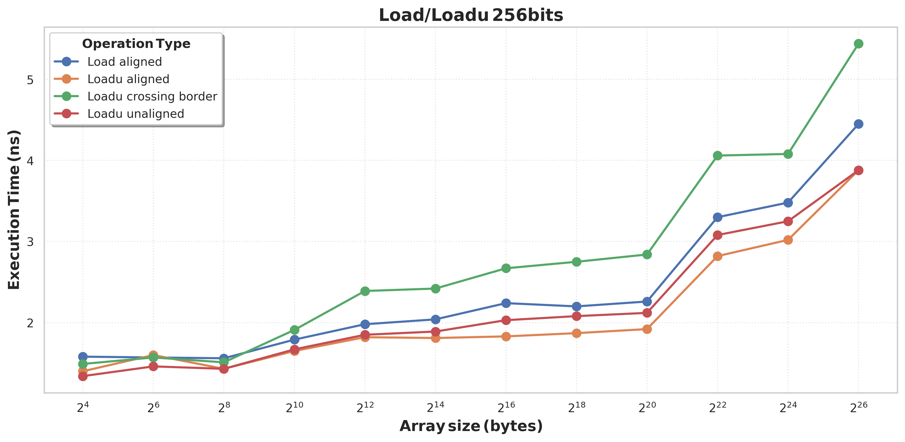
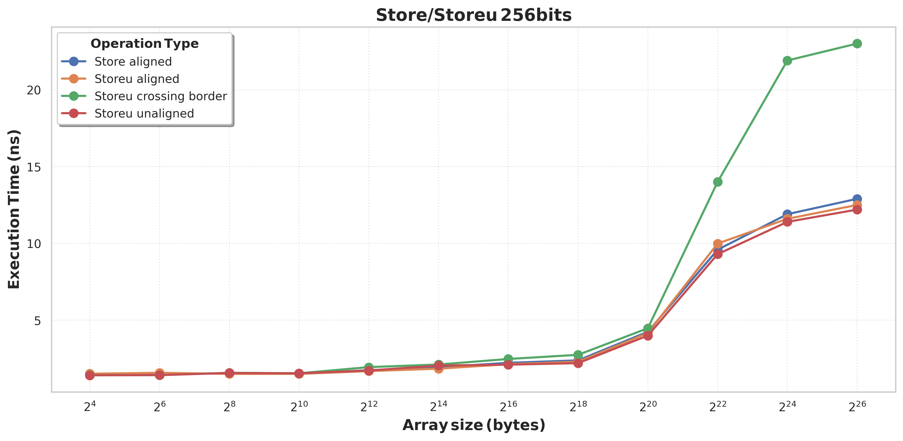
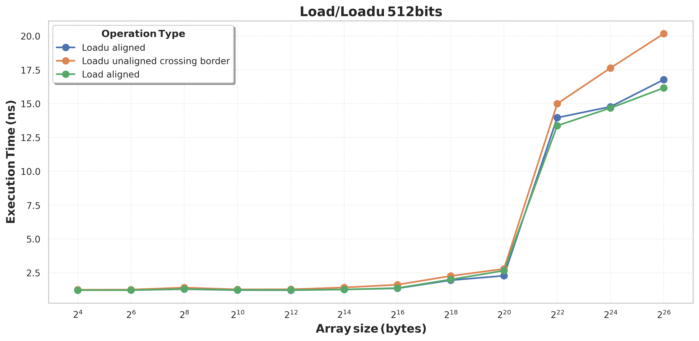
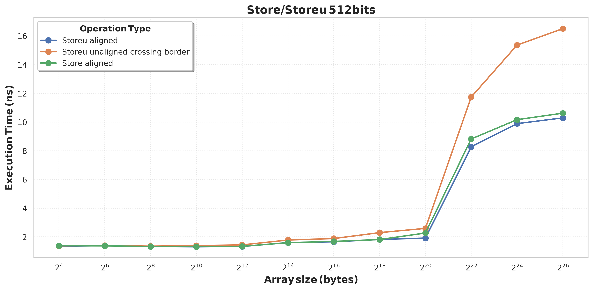
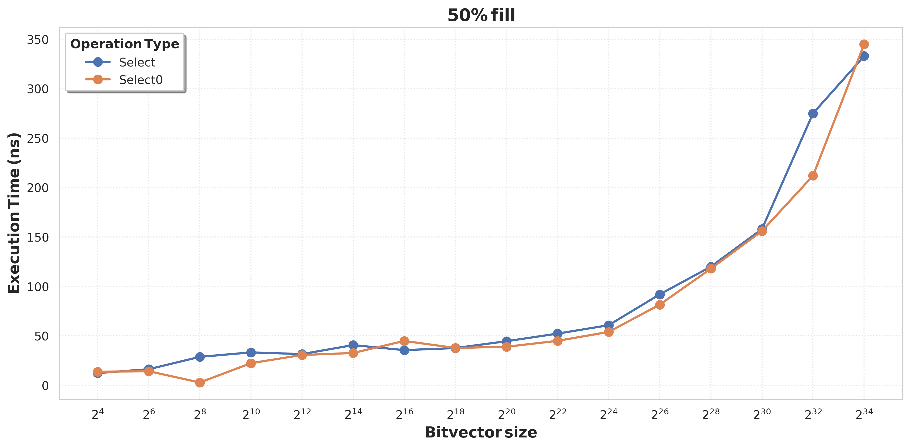
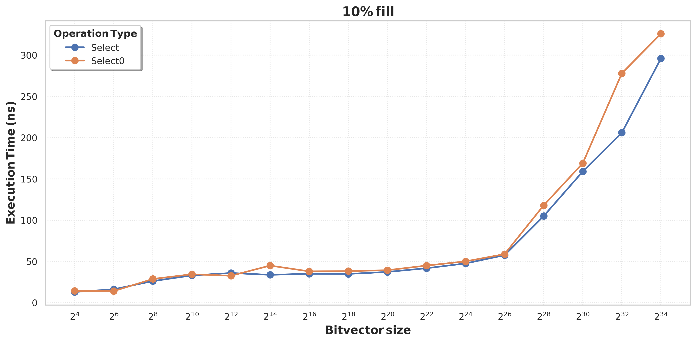
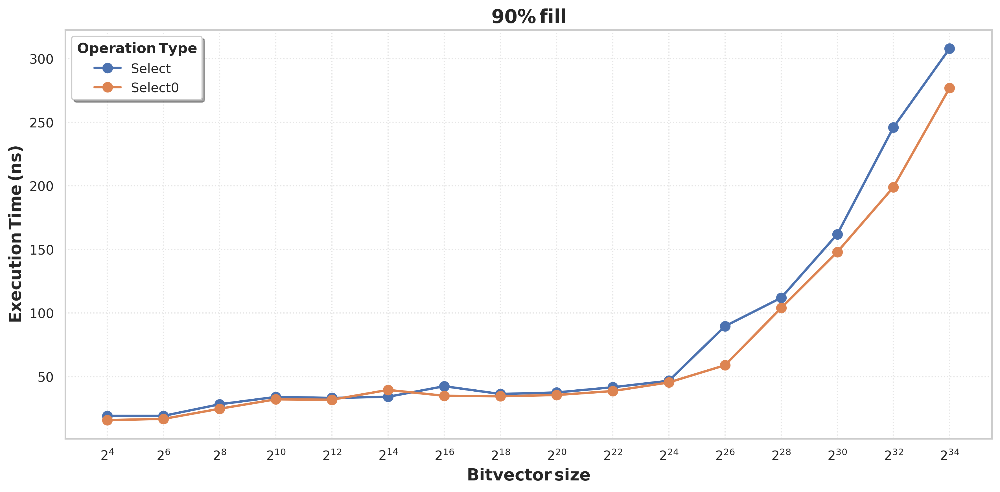
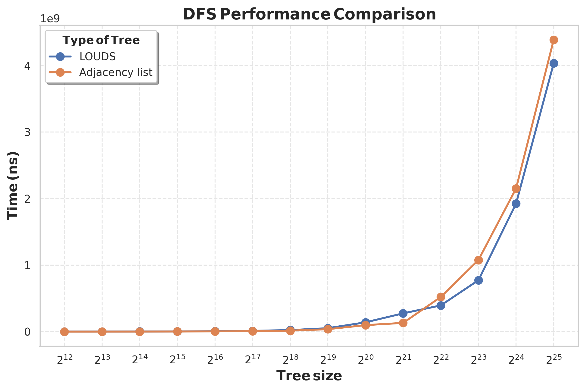

# Отчет по семестровому проекту

## План

1. Aligned/unaligned инструкции
2. Rank0/Select0
3. LOUDS Tree

## Aligned/unaligned инструкции

### Мотивация

Текущая реализация бит-вектора использует инструкции ```loadu/storeu```, поддерживающие невыровненные по размеру регистров адреса. Теоретически, невыровненные инструкции могут работать медленнее выровненных, так как запрос может пересекать границу кэш-линии. Попробуем замерить и сравнить время работы для различных случаев.

### Эксперименты для 256-битных инструкций

Стандартный размер кэш-линии у большинства процессоров равен 64-м байтам (512 битам).
Для блока из 256 бит возможны следующие варианты:
1. Адрес выровнен
2. Адрес невыровнен, блок полность попадает в одну кэш-линию
3. Адрес невыровнен, блок перескает границу кэш-линий

Ниже приведены графики времени выполнения одной 256-битной инструкции на случайном адресе в зависмости от размера массива.




Замеры выполнялись на процессоре AMD Ryzen 5 5600H 6 Cores / 12 Threads.
Размеры кэшей:
* L1 Data 32 KiB (x6)
* L1 Instruction 32 KiB (x6)
* L2 Unified 512 KiB (x6)
* L3 Unified 16384 KiB (x1)

Для ```load/loadu``` инструкций существенных различий не наблюдатеся, все различия в пределах 1.5 нс.  
Для ```store/storeu``` аналогично, кроме ситуации с пересечением границы кэш-линии, в этом случае, как только массив перестает помещаться в L3 (2<sup>21</sup> байт), операция сильно замедляется.

### Эксперименты для 512-битных инструкций

Для блока из 512 бит возможны следующие варианты:
1. Адрес выровнен
2. Адрес невыровнен, блок перескает границу кэш-линий




Замеры выполнялись на процессоре ... 6 Cores / 12 Threads.
Размеры кэшей:
* L1 Data 32 KiB (x8)
* L1 Instruction 32 KiB (x8)
* L2 Unified 1024 KiB (x8)
* L3 Unified 16384 KiB (x1)

Для ```load/loadu``` инструкций различия в пределах 3 нс.  
Для ```store/storeu``` снова явное замедление при пересечении границы кэш-линий.

### Выводы

По наблюдаемым результатм можно сделать вывод, что оптимальнее использовать выровненные инструкции.
В реализации бит-вектора ```storeu``` использовалась только в одной функции ```rank_512``` и была заменена на выровненную версию.
Замена ```loadu``` на ```load``` требует изменения логики всего алгоритма без потери эффективности, пока что отложена.

## Rank0/Select0

### Выбор реализации

```rank0``` реализуется тривиально: ```rank0(pos) = pos - rank(pos)```.  
C ```select0``` несколько сложнее:
1. Можно хранить копии массивов предподсчитаных значений для инвертированного исходного массива, такой подход удвоит текущий 3.61% оверхэд.  
2. Согласно статье "Engineering Compact Data Structures for Rank and Select Queries on Bit Vectors" Florian Kurpicz 
можно реализовать вторую операцию (в нашем случае ```select0```) без дополнительной памяти но с замедлением в ~1.5 раза.
3. Можно дополнительно предпосчитать позиции нулей с частатой ```kSelectSampleFrequency```, как это было сделано для единиц и ```select```. Тогда оверхэд увеличится всего на 0.4%, но ```select0``` будет работать медленнее ```select```.

Был выбран третий вариант, так как количество дополнительной памяти и, как окажется далее, замедленее ```select0``` незначительные.

### Реализация

Реализация ```select0``` почти полностью повторяет ```select```, основное отличие в том, что для базовых и супер блоков на префиксах предподсчитаны количества единиц, а нужны количества нулей. Нужно учитывать это при обращении к блокам, предварительно вычитая ранк из длины префикса. Для битовых операций ```lower_bound_*```, при выполнении которых одна инструкция затрагивает сразу несколько блоков, созданы копии ```lower_bound_dlt_*```, учитывающие предварительное вычитание и принимающие на вход позицию первого блока и предподсчитанную арифметическую прогрессию с шагом в размер блока.  
Для нового функционала реализованы тесты и добавлены в CI. Для ```rank0/select0``` реализованы бенчмарки.

### Время работы

Ниже приведены графики времени выполнения различных операциий в зависмости от размера массива с различными процентами заполнения (количеством единиц). Замеры выполнялись на процессоре AMD Ryzen 5 5600H 6 Cores / 12 Threads с поддержкой AVX2 (нужно также замерить для AVX512).
Размеры кэшей:
* L1 Data 32 KiB (x6)
* L1 Instruction 32 KiB (x6)
* L2 Unified 512 KiB (x6)
* L3 Unified 16384 KiB (x1)





По графикам можно сказать, что обе операции работают примерно одинаково. Также видна прямая зависимость времени выполнения ```select/select0``` от количества единичных/нулевых битов соответсвенно, которая является следствием реалиации. 

## LOUDS Tree

### Реализация

Level Order Unary Degree Sequence - сжатое представление дерева в виде последовательности битов длины 2n-1.
Идея взята из [sdsl](https://github.com/simongog/sdsl-lite/blob/master/include/sdsl/louds_tree.hpp).
Дерево представляется в порядке обхода в ширину: для каждого узла записываем единичный бит, за которым следует столько нулей, сколько у этого узла детей.  
Для вершин создан отдельный класс ```LoudsNode```, хранящий номер вершины и ее позицию в LOUDS представлении. Это позволяет реализовать все основные операции для навигации с помощью ```select/select0```.  
Реализованы две дополнительные операции, которых нет в [sdsl](https://github.com/simongog/sdsl-lite/blob/master/include/sdsl/louds_tree.hpp):
* node next_sibling(node) - Возвращает следующего брата (сына отца в порядке BFS).
* bool is_last_child(node) - Проверяет, является ли текущая вершина последним сыном в порядке BFS среди братьев.

Они позволяют обходить дерево в порядке DFS с $O(1)$ дополнительной памяти.  
Реализованы тесты и бенчмарки, а также дерево на списке смежности для них.

### Сравнение со стандартной реализацией

Будем сравнивать LOUDS реализацию дерева с реализацией на списке смежности. Для каждого размера строим 10 случайных деревьев и берем среднее время их обхода.  
Замеры выполнялись на процессоре AMD Ryzen 5 5600H 6 Cores / 12 Threads с поддержкой AVX2 (нужно также замерить для AVX512).
Размеры кэшей:
* L1 Data 32 KiB (x6)
* L1 Instruction 32 KiB (x6)
* L2 Unified 512 KiB (x6)
* L3 Unified 16384 KiB (x1)



По графику можно сказать, что LOUDS работает не хуже. При росте размера дерева LOUDS немного выигрывает у стандартной реализации, что объясняется меньшим количеством кэш-промахов.  
Также по полученным результатам можно оценить эффективность бит-вектора, до этого момента ее замеряли только на равномерно распределнных данных.